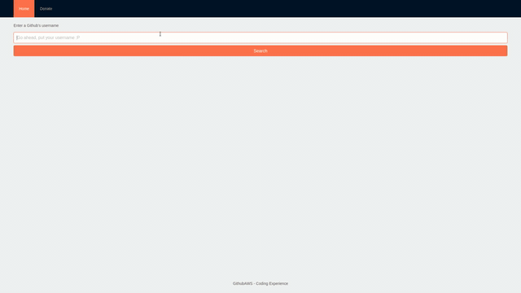

# Github AWS

Home page: https://eloquent-wozniak-630f0e.netlify.com/

It's a react application that consumes an AWS Lambda API which processes Github API data.

This app was configurated from scratch, without using Create React App or any tool like that.

It uses Antd as UI kit and doesn't uses Redux, only hooks. Also, there's React Router Dom to manage routing.